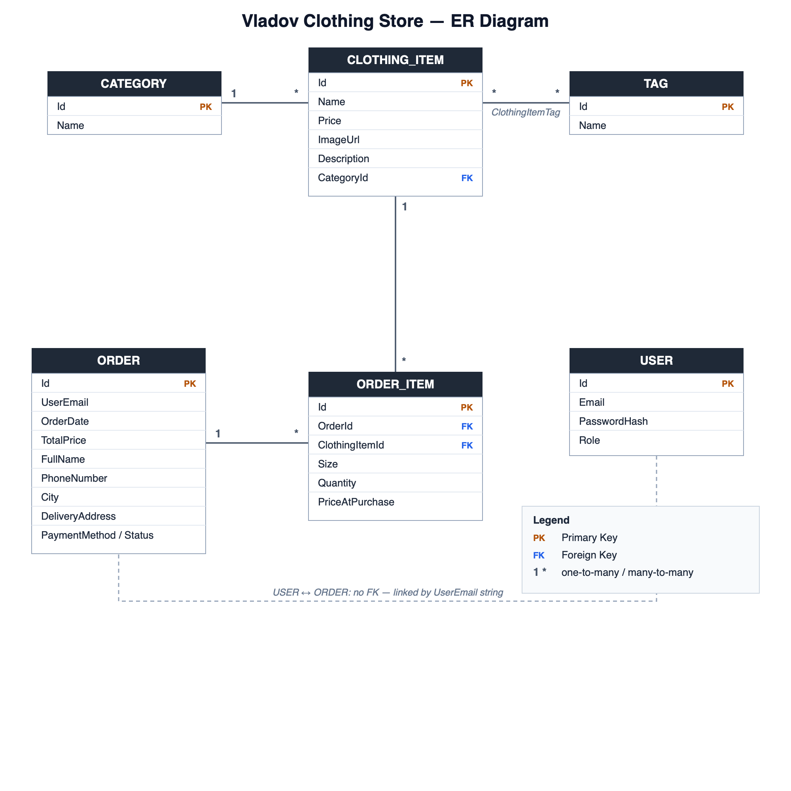

# Vladov Clothing Store

A full-stack e‑commerce demo for a fashion/clothing store. It consists of an **ASP.NET Core (.NET 10) REST API** backed by **SQLite + Entity Framework Core**, and a **React (Vite) single-page frontend**. The app supports browsing products, a shopping cart with size selection, JWT-based authentication, an admin product-management panel, order checkout, and transactional emails (welcome + order confirmation) sent via Gmail SMTP.

> The backend code, comments, and UI text are primarily in **Bulgarian**. This README documents the project in English.

---

## Table of Contents

1. [Tech Stack](#tech-stack)
2. [Architecture Overview](#architecture-overview)
3. [Project Structure](#project-structure)
4. [Data Model & ER Diagram](#data-model--er-diagram)
5. [Backend Components](#backend-components)
6. [API Reference](#api-reference)
7. [Authentication & Authorization](#authentication--authorization)
8. [Frontend (UI)](#frontend-ui)
9. [Email Service](#email-service)
10. [Getting Started](#getting-started)
11. [Configuration](#configuration)
12. [Database & Migrations](#database--migrations)
13. [Swagger / API Docs](#swagger--api-docs)
14. [Security Notes](#security-notes)

---

## Tech Stack

### Backend
| Area | Technology |
|------|------------|
| Runtime | .NET 10 (`net10.0`) |
| Framework | ASP.NET Core Web API (Controllers) |
| ORM | Entity Framework Core 10 |
| Database | SQLite (`fashion.db`) |
| Auth | JWT Bearer tokens (`Microsoft.AspNetCore.Authentication.JwtBearer`) |
| Password hashing | BCrypt.Net-Next |
| Email | MailKit / MimeKit (Gmail SMTP) |
| API docs | Swashbuckle (Swagger / OpenAPI) |

### Frontend
| Area | Technology |
|------|------------|
| Library | React 19 |
| Build tool | Vite 8 |
| Language | JavaScript (JSX) |
| Styling | Plain CSS (`App.css`, `index.css`) + inline styles |
| HTTP | Native `fetch` API |
| State persistence | `localStorage` (JWT token, email, order history) |

---

## Architecture Overview

```
┌──────────────────────────┐         HTTP (JSON, JWT)        ┌─────────────────────────────┐
│   React SPA (Vite)        │  ───────────────────────────▶  │   ASP.NET Core Web API       │
│   http://localhost:5173   │  ◀───────────────────────────  │   http://localhost:5010      │
│                           │                                 │                              │
│  - Storefront / catalog   │                                 │  Controllers                 │
│  - Cart + checkout        │                                 │   ├─ AuthController          │
│  - Auth (login/register)  │                                 │   ├─ ClothesController       │
│  - Admin panel            │                                 │   └─ OrdersController        │
│  - Order history          │                                 │  Services (StoreService,     │
└──────────────────────────┘                                 │            EmailService)     │
                                                              │  EF Core DbContext           │
                                                              │       │                      │
                                                              │       ▼                      │
                                                              │   SQLite (fashion.db)        │
                                                              │                              │
                                                              │   Gmail SMTP (MailKit) ──────┼──▶ ✉️
                                                              └─────────────────────────────┘
```

The backend follows a layered pattern:

- **Controllers** handle HTTP routing, model binding, and authorization.
- **Services** (`StoreService`, `EmailService`) hold business logic and data access.
- **DTOs** decouple the public API shape from the EF entities.
- **Middleware** (`ExceptionMiddleware`) provides centralized error handling with environment-aware responses.

---

## Project Structure

```
FashionStoreApi/
├── Program.cs                     # App bootstrap: DI, CORS, JWT, Swagger, seeding
├── appsettings.json               # JWT, logging, connection string, email settings
├── VladovClothingStore.csproj     # NuGet dependencies, target framework
├── fashion.db                     # SQLite database (created/used at runtime)
│
├── Controllers/
│   ├── AuthController.cs           # register / login, JWT issuance
│   ├── ClothesController.cs        # CRUD for products + "buy" endpoint
│   └── OrdersController.cs         # order creation
│
├── Services/
│   ├── IStoreService.cs            # store business-logic contract
│   ├── StoreService.cs             # product CRUD + order creation + order email
│   ├── IEmailService.cs            # email contract
│   └── EmailService.cs             # MailKit SMTP implementation
│
├── Models/                         # EF Core entities
│   ├── ClothingItem.cs
│   ├── Category.cs
│   ├── Tag.cs
│   ├── User.cs
│   ├── Order.cs
│   └── OrderItem.cs
│
├── Dtos/                           # request/response shapes
│   ├── ClothingReadDto.cs
│   ├── ClothingCreateDto.cs
│   ├── ClothingUpdateDto.cs
│   ├── CategoryReadDto.cs
│   ├── OrderCreateDto.cs
│   └── OrderItemCreateDto.cs
│
├── Data/
│   └── ApplicationDbContext.cs     # DbSets + relationship configuration
│
├── MiddleWare/
│   └── ExceptionMiddleware.cs      # global exception → JSON
│
├── Migrations/                     # EF Core migrations (6 total)
│
└── vladov-store-frontend/          # React + Vite SPA
    ├── index.html
    ├── package.json
    ├── vite.config.js
    └── src/
        ├── main.jsx                # React entry point
        ├── App.jsx                 # storefront, cart, auth, checkout, history
        ├── AdminPanel.jsx          # product management table/form
        ├── App.css / index.css     # styling
        └── assets/                 # images (hero, logos)
```

---

## Data Model & ER Diagram

### Entities

| Entity | Key fields | Notes |
|--------|------------|-------|
| **Category** | `Id`, `Name` | Has many `ClothingItem` |
| **ClothingItem** | `Id`, `Name`, `Price` (decimal), `ImageUrl`, `Description`, `CategoryId` | Belongs to a `Category`; many-to-many with `Tag` |
| **Tag** | `Id`, `Name` | Many-to-many with `ClothingItem` (join table `ClothingItemTag`) |
| **User** | `Id`, `Email`, `PasswordHash`, `Role` | BCrypt-hashed password |
| **Order** | `Id`, `UserEmail`, `OrderDate`, `TotalPrice`, `FullName`, `PhoneNumber`, `City`, `DeliveryAddress`, `PaymentMethod`, `Status` | Has many `OrderItem` |
| **OrderItem** | `Id`, `OrderId`, `ClothingItemId`, `Size`, `Quantity`, `PriceAtPurchase` | Snapshots the price at purchase time |

### ER Diagram



**Relationship behavior** (configured in `ApplicationDbContext.OnModelCreating`):
- `Order` → `OrderItem`: cascade delete (deleting an order removes its items).
- `ClothingItem` → `OrderItem`: **restrict** delete (a product cannot be deleted while referenced by an order item).
- `User` is standalone — orders are linked only by the `UserEmail` string, not a foreign key.

---

## Backend Components

### `Program.cs`
- Registers CORS policy `AllowReact` for `http://localhost:5173`.
- Configures JWT bearer authentication (HMAC-SHA256, issuer/audience `VladovAPI`, 1‑day token lifetime, zero clock skew).
- Registers Swagger with a Bearer security scheme.
- Wires DI: `ApplicationDbContext` (SQLite `fashion.db`), `IStoreService`, `IEmailService`.
- Adds the global `ExceptionMiddleware`.
- **Seeds** a default `"Summer Collection"` category on startup if the `Categories` table is empty.

### `StoreService`
- `GetAllClothesAsync()` / `GetClothingByIdAsync(id)` — read products (joined with category) into `ClothingReadDto`.
- `AddClothingAsync` / `UpdateClothingAsync` / `DeleteClothingAsync` — product CRUD.
- `CreateOrderAsync(orderDto)` — builds an `Order` + `OrderItem`s, **re-reads each product's price from the DB** (so the client cannot tamper with prices), computes the total, persists, and sends an HTML order-confirmation email (free shipping over €100, otherwise €5).

### `ExceptionMiddleware`
- Catches unhandled exceptions, logs them, and returns JSON.
- In **Development**: includes the exception message + stack trace.
- In **Production**: returns a generic safe message.

---

## API Reference

Base URL: `http://localhost:5010`

### Auth — `/api/Auth`
| Method | Route | Auth | Body | Description |
|--------|-------|------|------|-------------|
| POST | `/api/Auth/register` | Anonymous | `{ email, password }` | Creates a user (BCrypt-hashed), sends a welcome email. |
| POST | `/api/Auth/login` | Anonymous | `{ email, password }` | Returns `{ token }` (JWT) on valid credentials. |

> **Note:** registration currently assigns every new user the role **`Admin`** (see [Security Notes](#security-notes)). Passwords must be ≥ 6 characters and the email must be valid.

### Clothes — `/api/clothes`
| Method | Route | Auth | Body | Description |
|--------|-------|------|------|-------------|
| GET | `/api/clothes` | Anonymous | — | List all products. |
| POST | `/api/clothes` | **Admin** | `ClothingCreateDto` | Create a product. |
| PUT | `/api/clothes/{id}` | **Admin** | `ClothingUpdateDto` | Update a product. |
| DELETE | `/api/clothes/{id}` | **Admin** | — | Delete a product. |
| POST | `/api/clothes/{id}/buy` | Authenticated | — | "Quick buy" a single item; sends a confirmation email. |

`ClothingCreateDto`:
```json
{
  "name": "Summer T-Shirt",
  "price": 29.99,
  "categoryId": 1,
  "imageUrl": "https://example.com/shirt.jpg",
  "description": "Lightweight cotton tee"
}
```

### Orders — `/api/orders`
| Method | Route | Auth | Body | Description |
|--------|-------|------|------|-------------|
| POST | `/api/orders` | Anonymous | `OrderCreateDto` | Create a multi-item order (cart checkout); sends a confirmation email. |

`OrderCreateDto`:
```json
{
  "userEmail": "customer@example.com",
  "fullName": "Ivan Ivanov",
  "phoneNumber": "0888123456",
  "city": "Sofia",
  "deliveryAddress": "Vitosha Blvd 1",
  "paymentMethod": "Наложен платеж",
  "items": [
    { "clothingItemId": 1, "size": "M", "quantity": 2 }
  ]
}
```

---

## Authentication & Authorization

- On **login**, the server issues a JWT signed with HMAC-SHA256.
- The token carries `Name` (email) and `Role` claims; it is valid for **1 day**.
- Protected endpoints use `[Authorize]` / `[Authorize(Roles = "Admin")]`.
- The frontend stores the token in `localStorage` and sends it as `Authorization: Bearer <token>` on protected requests.

⚠️ The signing key is **hard-coded** in both `Program.cs` and `AuthController.cs` (`"vladovstoresecretkey123456789012"`). The `Jwt` section in `appsettings.json` (with different issuer/audience) is **not** actually used by the running code — see [Security Notes](#security-notes).

---

## Frontend (UI)

The SPA (`vladov-store-frontend`) is a single `App.jsx` storefront plus an `AdminPanel.jsx`. Key features:

- **Product catalog** — fetched from `GET /api/clothes`, rendered as cards with image, name, price (€), and description. Falls back to an Unsplash placeholder if `imageUrl` is empty.
- **Product detail modal** — larger image + description + size/quantity selection.
- **Shopping cart** — add items with a selected **size** and **quantity**, open/close cart drawer, see totals.
- **Checkout flow** — collects delivery details (name, phone, city, address) and payment method, then `POST`s to `/api/orders`.
- **Authentication** — login/register modal; on success the JWT + email are persisted in `localStorage`.
- **Order history** — stored per-user in `localStorage` (`orders_<email>`) and shown in a history panel.
- **Admin panel** — table of products with create/edit/delete, calling the admin-protected `/api/clothes` endpoints with the Bearer token. Includes image preview.

All API calls point at `http://localhost:5010` (hard-coded in `App.jsx` and `AdminPanel.jsx`). Vite dev server runs on `http://localhost:5173`, which the backend CORS policy explicitly allows.

---

## Email Service

`EmailService` uses **MailKit** to send HTML emails over Gmail SMTP (`smtp.gmail.com:587`, STARTTLS). Three email types are sent:

1. **Welcome email** — after registration.
2. **Order confirmation** — after `POST /api/orders` (itemized table, delivery details, shipping rules, grand total).
3. **Quick-buy confirmation** — after `POST /api/clothes/{id}/buy`.

All email sends are wrapped in `try/catch`, so an SMTP failure **does not** fail the underlying operation (registration/order still succeed). SMTP settings are read from the `EmailSettings` section of `appsettings.json`.

---

## Getting Started

### Prerequisites
- **.NET 10 SDK** — verify with `dotnet --version` (project built with `10.0.107`).
- **Node.js 18+** (project tested with `v24`) and npm — for the frontend.
- **`dotnet-ef` tool** (for migrations):
  ```bash
  dotnet tool install --global dotnet-ef
  # ensure it's on PATH:
  export PATH="$PATH:$HOME/.dotnet/tools"
  ```

### 1. Clone
```bash
git clone https://github.com/BozhidarVladov/FashionStoreApi.git
cd FashionStoreApi
```

### 2. Run the backend
```bash
# restore dependencies
dotnet restore

# apply database migrations (creates/updates fashion.db)
dotnet ef database update

# run the API
dotnet run
```
The API starts on **http://localhost:5010**. On first run it seeds a `"Summer Collection"` category.

> If you see `SQLite Error 1: 'no such column: ...'`, it means the database is missing a migration — run `dotnet ef database update`.

### 3. Run the frontend
In a second terminal:
```bash
cd vladov-store-frontend
npm install
npm run dev
```
The SPA starts on **http://localhost:5173**. Open it in your browser.

### 4. Try it out
1. Open the SPA, click **Register** and create an account (use a real email if you want to receive the welcome email; otherwise email failures are ignored).
2. Log in — you'll receive a JWT (stored automatically).
3. Browse products, add to cart, and checkout.
4. Because registration grants the **Admin** role, you can also open the **Admin panel** to add/edit/delete products.

### Frontend production build
```bash
cd vladov-store-frontend
npm run build      # outputs to dist/
npm run preview    # serve the built bundle locally
```

---

## Configuration

`appsettings.json` keys:

| Section | Key | Purpose |
|---------|-----|---------|
| `Jwt` | `Key`, `Issuer`, `Audience` | **Currently unused** — the running code hard-codes JWT settings instead. |
| `ConnectionStrings` | `DefaultConnection` | Set to `VladovStore.db` but **unused** — `Program.cs` hard-codes `Data Source=fashion.db`. |
| `EmailSettings` | `SmtpServer`, `Port`, `SenderEmail`, `SenderName`, `Password` | Gmail SMTP credentials used by `EmailService`. |
| `Logging` | `LogLevel` | Standard ASP.NET Core logging configuration. |

To use your own Gmail account, generate a **Gmail App Password** (with 2FA enabled) and set `EmailSettings:SenderEmail` + `EmailSettings:Password`.

The active database file is **`fashion.db`** (defined in `Program.cs`, line ~63). The launch URL/port is configured in `Properties/launchSettings.json` (`http://localhost:5010`, `Development` environment).

---

## Database & Migrations

The project uses EF Core code-first migrations. Current migrations (in order):

1. `InitialProjectSetup` — Categories, Clothes, Tags.
2. `AddManyToManyTags` — `ClothingItemTag` join table.
3. `AddUserTable` — Users.
4. `AddImageUrlToClothing` — adds `ImageUrl`, restructures tag relationship.
5. `AddDescriptionToClothing` — adds `Description`.
6. `AddOrdersAndOrderItems` — Orders + OrderItems.

Common commands (run from the project root, with `dotnet-ef` installed):
```bash
# apply all pending migrations to the database
dotnet ef database update

# see migration status (Pending vs applied)
dotnet ef migrations list

# create a new migration after changing a model
dotnet ef migrations add <MigrationName>

# generate an idempotent SQL script (useful for production deploys)
dotnet ef migrations script --idempotent -o migrate.sql
```

> **Tip:** migrations are *not* applied automatically on startup. After pulling new code or adding a migration, always run `dotnet ef database update`. (Optionally, add `context.Database.Migrate();` in the startup scope of `Program.cs` to auto-apply on launch — convenient for development.)

---

## Swagger / API Docs

When running in **Development**, interactive API docs are available via Swagger UI:

```
http://localhost:5010/swagger
```

Swagger is configured with a **Bearer** security scheme, so you can:
1. Call `POST /api/Auth/login` to get a token.
2. Click **Authorize** in Swagger UI and enter `Bearer <token>`.
3. Call the protected admin/authenticated endpoints directly from the browser.

---

## Security Notes

> This is a learning/demo project. The following issues should be addressed before any real-world use:

1. **Secrets committed to source control** — `appsettings.json` contains a live Gmail **App Password** and the JWT key is hard-coded. Rotate the Gmail password immediately, move secrets to environment variables / user-secrets, and never commit them.
2. **Dynamic Role Assignment** — User roles are not hardcoded globally; instead, they are determined by the specific logic implemented within the `Register` method of the `AuthController`, allowing easy adjustments between `User` and `Admin` default privileges.
3. **Hard-coded JWT signing key** — duplicated in `Program.cs` and `AuthController.cs`. Read it from configuration/secrets and use a strong random key. The `Jwt` section in `appsettings.json` is currently dead config (different issuer/audience than what the code uses).
4. **Order creation is anonymous** — `POST /api/orders` allows `[AllowAnonymous]` and trusts the client-supplied `userEmail`. (Prices, at least, are re-read server-side, which is good.) Consider requiring authentication and deriving the email from the token.
5. **CORS / config mismatch** — `ConnectionStrings:DefaultConnection` (`VladovStore.db`) does not match the actual DB used (`fashion.db`); clean up unused config to avoid confusion.
```
